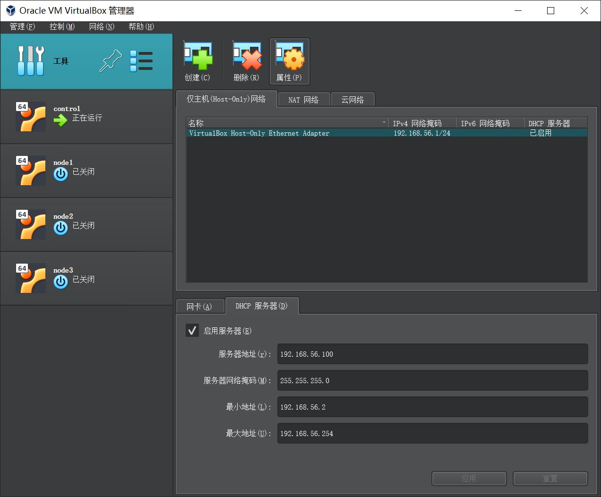

### 设定静态 ip

1. 确认 virtualbox 网络管理器
   在菜单栏 选中 管理->工具->网络管理器
   <!-- 
    -->
   
   
   
2. 配置虚拟机网络
   选中虚拟机 然后点击属性 选择网络，网卡 1 选择为 NAT 模式，网卡 2 选择为 host-only 模式
   
   
3. 编辑 ubuntu 网卡

   ```sh
   $ sudo vim /etc/netplan/00-installer-config.yaml

   # This is the network config written by 'subiquity'
   network:
       ethernets:
           enp0s8:
           dhcp4: no
           addresses:
           - 192.168.56.101/24
           enp0s3:
           dhcp4: no
           addresses:
               - 10.0.2.2/24
           nameservers:
               addresses:
               - 114.114.114.114
               - 8.8.8.8
               - 8.8.4.4
           routes:
               - to: 0.0.0.0/0
               via: 10.0.2.1
   version: 2

   $ sudo netplan apply
   ```

### 后记 不是很重要 有关 dhclient 的解惑

我从 ai 那里问来的答案中还有提及到 sudo dhclient -r 是用来删除 dhcp 的，在尝试 ip a 查看网卡是 会显示 ip 都消失了。
然后再执行 sudo dhclient 会重新分配 ip。但是这里并不推荐使用这两个命令行 我这里使用的静态 ip。由于 dhcp 是 自动递增 ip 的 再每台机器上执行之后会自动递增，我之前新建的虚拟机名字叫做 node1 node2 node3 执行 dhclient 的时候执行顺序错了，很烦人只能重新 remove 了它 然后给 node1 分配 ip 的时候是 删除前的 ip +1 ，强迫症犯了直接指定静态 ip 了。
host-only 模式下 虚拟机和主机之间是可以通过 ping 通的，但是主机和主机之间是 ping 不通的。
nat 模式下 虚拟机和主机之间是可以通过 ping 通的（但是需要做端口转发，这样会占用宿主机的端口），主机和主机之间也是可以 ping 通的。


```sh
ssh ubuntu@127.0.0.1 -p 2222
```

如果不能成功 可能还需要修改 netplan 设定 dhcp: yes

```
   network:
        ethernets:
            enp0s3:
                dhcp4: yes
    version: 2
```

这里还是用的 10.2.15 没法解决自定义的问题，之后执行`sudo dhclient -r`和`sudo dhclient`就好了 可以把端口映射的 10.0.2.15 改成新的 ip 理论上是可以了。我没有在继续研究了 没必要了，还是自定义静态 ip 比较方便。
